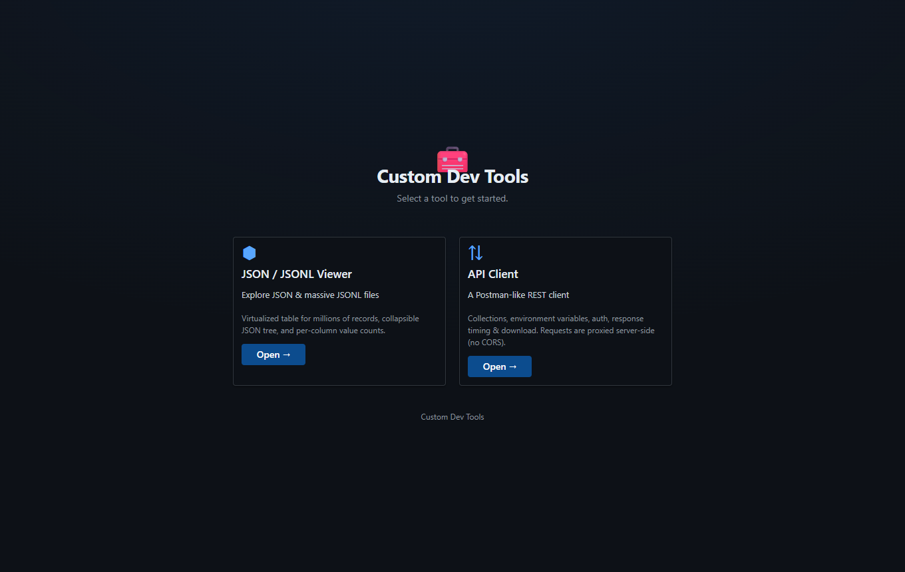
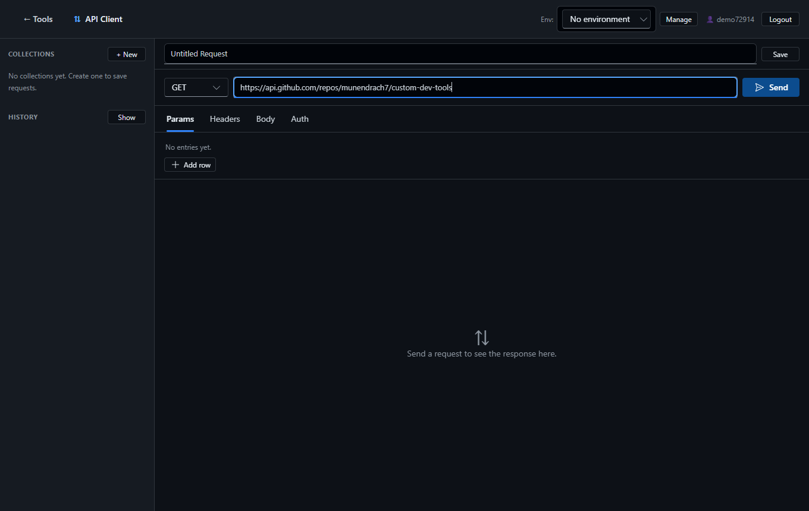
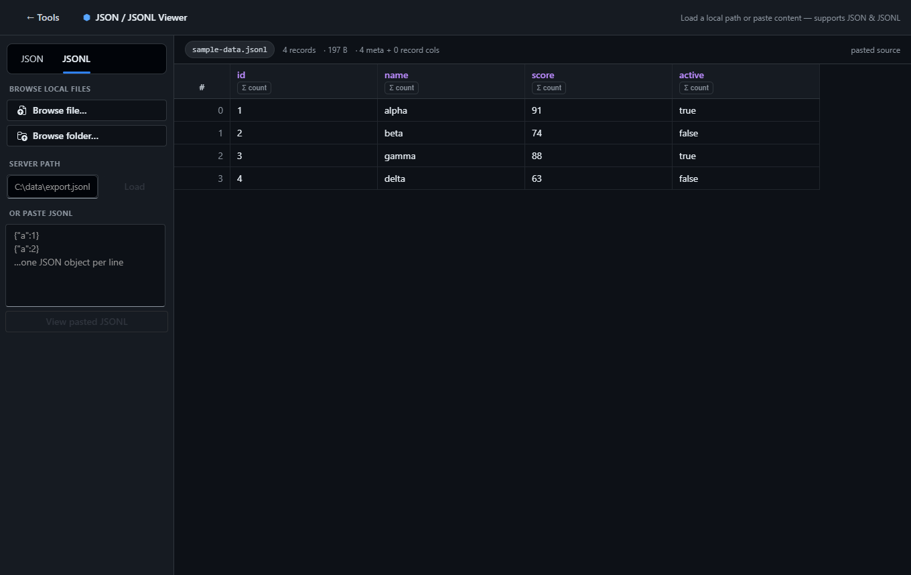

# Custom Dev Tools

A dark-themed workspace that hosts multiple developer tools behind a single launcher.
Pick a tool from the home menu and dive in. Built to be extended — more tools can be
added to the registry over time.

Current tools:

| Tool | What it does |
| ---- | ------------ |
| **JSON / JSONL Viewer** | Explore JSON and massive JSONL/NDJSON files in a virtualized table (millions of rows), a collapsible JSON tree, and per-column value counts. |
| **API Client** | A Postman-like REST client: collections, environment variables, request auth, response visualization, timing, size, and download. Backed by SQL with user accounts. |

## Screenshots

**Launcher** — pick a tool to open it.



**API Client** — a Postman-like REST client with collections, environments, auth,
response timing/size, and download.



**JSON / JSONL Viewer** — browse a file or folder (or paste), then explore records in a
virtualized table with per-column value counts.



## Project structure

The repo is organized like a product, with the frontend, each backend service, and their
Docker assets cleanly separated:

```
custom-dev-tools/
├── docker-compose.yml          # orchestrates web + both backends + SQL Server
├── .env.example                # configuration template
├── package.json                # monorepo root / dev orchestrator (concurrently)
├── docs/screenshots/           # images used in this README
├── frontend/                   # React + Vite + Fluent UI SPA
│   ├── Dockerfile              # build SPA, serve via nginx
│   ├── nginx.conf              # SPA + reverse proxy to /api and /client
│   ├── index.html
│   ├── vite.config.js
│   ├── package.json
│   ├── public/                 # favicon and static assets
│   └── src/                    # app code (launcher, viewer, apiclient/)
└── services/
    ├── jsonl-api/              # Node/Express JSON/JSONL file indexer
    │   ├── Dockerfile
    │   ├── package.json
    │   └── src/index.js
    └── api-client/            # Python/FastAPI API-Client backend
        ├── Dockerfile
        ├── requirements.txt
        └── app/               # FastAPI app (auth, models, routes, proxy)
```

## Launcher

When the app loads you land on the **tools menu**. Select a card to open a tool; a
**← Tools** button in each tool's top bar returns you to the menu. Adding a new tool
later is just a new entry in `TOOLS` in `frontend/src/App.jsx` plus its component.

## API Client (Postman-like)

- **Accounts & auth** — register / login; a JWT is stored in the browser and every
  API-Client call is authenticated. Your collections, environments, and history are
  scoped to your account and **persist in SQL**.
- **Collections & requests** — organize saved requests into collections. Each request
  has a method (GET/POST/PUT/PATCH/DELETE/HEAD/OPTIONS), URL, query params, headers,
  body (JSON / raw), and authorization.
- **Request auth** — No Auth, Bearer token, Basic auth, or API key (header or query).
- **Environments & variables** — define `{{variable}}` values (global or per-collection)
  and interpolate them into the URL, params, headers, body, and auth at send time.
- **Response visualization** — status pill (color-coded), **response time (ms)**,
  **size**, content type, pretty JSON tree / raw / headers tabs, **copy**, and
  **download** of the response body.
- **History** — recent requests are recorded (method, URL, status, time, size) and can
  be replayed or cleared.
- **No CORS** — the frontend never calls target APIs directly. Every outbound request is
  **proxied server-side** by the Python backend (`POST /client/send`) using `httpx`, so
  browser CORS restrictions never apply.

### Backends

- **`services/api-client/`** — a **FastAPI (Python)** service backing the API Client:
  - **SQL Server** via SQLAlchemy + `pymssql` in Docker (a dedicated `db` container),
    or SQLite for local dev; JWT auth (bcrypt hashing). Selected by `DATABASE_URL`.
  - Routes under `/client/*`: `auth/register`, `auth/login`, `auth/me`, `collections`,
    `requests`, `environments`, `send` (proxy), and `history`.
- **`services/jsonl-api/`** — an **Express (Node)** service powering the JSON/JSONL viewer
  (byte-offset line index for random access into huge files). Routes under `/api/*`.

## Architecture

```
Browser (React SPA)
   |
   |-- /api/*     -> Node   (services/jsonl-api/)   JSON/JSONL file indexing
   \-- /client/*  -> Python (services/api-client/)  API Client + SQL + outbound proxy
```

In Docker, an **nginx** container serves the built SPA and reverse-proxies `/api` and
`/client` to the two backends.

## Run with Docker (recommended)

```bash
# optional: cp .env.example .env  and set SECRET_KEY
docker compose up --build
```

Then open **http://localhost:8080**.

| Container | Service | Build context | Role |
| --------- | ------- | ------------- | ---- |
| `devtools-web` | `web` (nginx) | `frontend/` | Serves the SPA, proxies `/api` and `/client`. |
| `devtools-jsonl-api` | `jsonl-api` (Node) | `services/jsonl-api/` | JSON/JSONL backend. |
| `devtools-api-client` | `api-client` (Python/FastAPI) | `services/api-client/` | API Client backend. |
| `devtools-db` | `db` (SQL Server 2022) | image | SQL database for accounts, collections, requests, environments, history. |

The SQL Server data lives in the `devtools-db-data` volume, so accounts/collections
**survive restarts**. On boot the `api-client` service creates the app database if
missing and retries the connection while SQL Server starts (~30-60s).

Behind a corporate pip mirror or egress proxy? Set `PIP_INDEX_URL` (build time) and/or
`HTTP_PROXY` / `HTTPS_PROXY` / `NO_PROXY` (runtime) — see `.env.example`.

## Run locally (without Docker)

Install dependencies for each package, then start everything with the root orchestrator:

```bash
npm install                 # root dev tools (concurrently)
npm run install:all         # installs frontend/ and services/jsonl-api/ deps

# Python backend (API Client)
python -m venv services/api-client/.venv
services/api-client/.venv/Scripts/pip install -r services/api-client/requirements.txt   # Windows
# source services/api-client/.venv/bin/activate && pip install -r services/api-client/requirements.txt  # *nix

npm run dev     # starts Node (5178) + FastAPI (8000) + Vite (5173)
```

- Frontend: http://localhost:5173 (Vite proxies `/api` -> 5178 and `/client` -> 8000)

> `npm run dev` calls `python` on your PATH for the FastAPI service. Activate the venv
> first, or run `npm run dev:api` separately. Individual services can also be started with
> `npm run dev:web`, `npm run dev:jsonl`, and `npm run dev:api`.

## JSON / JSONL Viewer

**Browse** a single file or a whole folder (read in the browser), point the server at a
**local path**, or **paste** JSON/JSONL directly. Top-level fields and keys inside
`_record` become columns; nested values open a collapsible JSON popup; any column can be
counted across the whole file. Supported extensions: `.jsonl`, `.ndjson`, `.jsonlines`.
